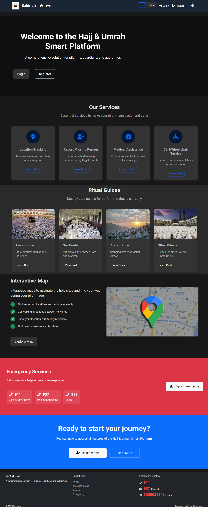
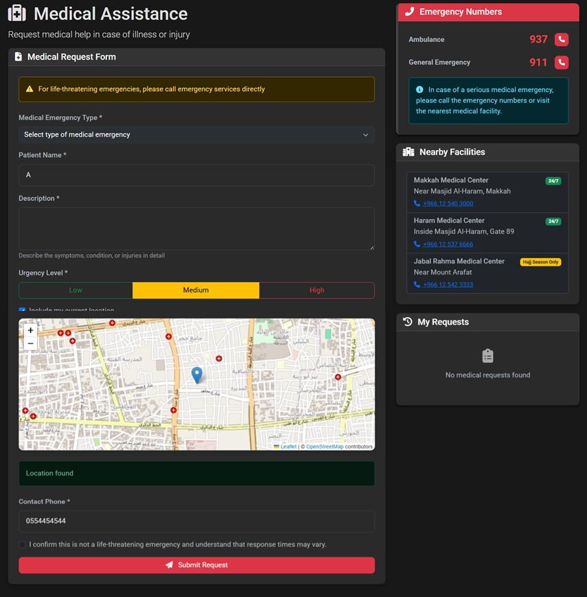
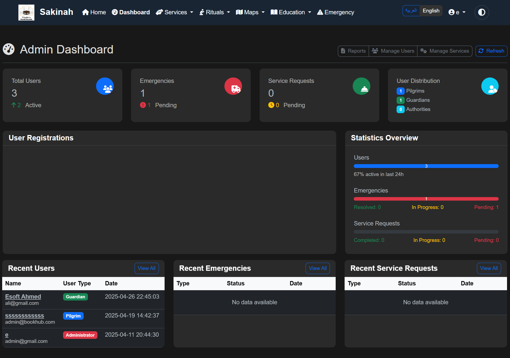
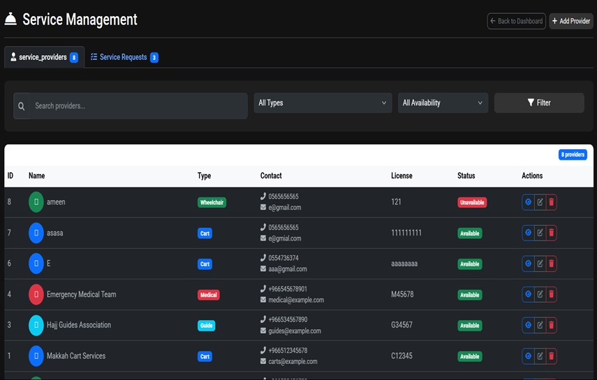
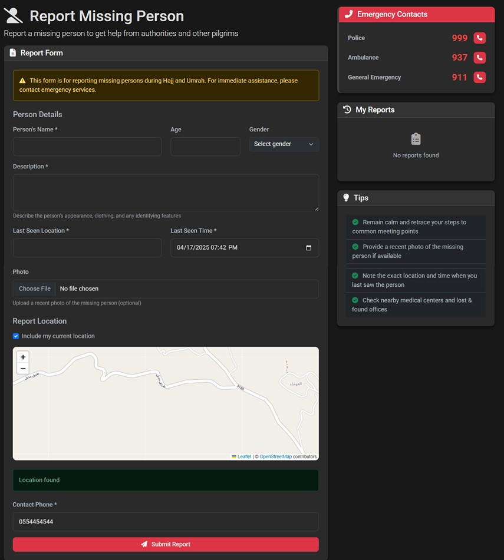

# Hajj and Umrah Smart Platform

A comprehensive web-based platform designed to enhance the pilgrimage experience for Hajj and Umrah pilgrims through digital services and smart features.

## 🕋 Overview

The Hajj and Umrah Smart Platform is a multilingual web application that provides pilgrims with essential services including real-time location tracking, ritual guidance, group management, emergency services, and service requests. The platform supports multiple user roles and is designed to handle large-scale crowds during peak pilgrimage seasons.

## ✨ Features

### 🔐 User Management
- Secure user authentication and registration
- Multi-role system (Pilgrim, Guardian, Authority, Admin)
- Profile management with photo upload
- Multilingual support (English & Arabic)
- Password recovery and account management

### 📍 Location Services
- Real-time GPS location tracking
- Group location sharing with privacy controls
- Distance calculation to Kaaba
- Qibla direction finder
- Interactive maps with points of interest
- Offline map capabilities

### 🕌 Ritual Guidance
- Step-by-step Tawaf guide with counter
- Sa'i guidance between Safa and Marwah
- Hajj ritual instructions (Arafat, Muzdalifah, Mina, Jamarat)
- Progress tracking for rituals
- Multilingual supplications and instructions
- Video tutorials and visual aids

### 👥 Group Management
- Create and manage pilgrim groups
- Invite members with unique codes
- Real-time group member locations
- Group messaging and notifications
- Guardian supervision features

### 🚨 Emergency Services
- Emergency reporting system
- Missing person reports with photos
- Medical assistance requests
- Real-time emergency tracking
- Authority notification system
- Emergency contact integration

### 🚐 Service Requests
- Cart and wheelchair services
- Medical assistance requests
- Guide services
- Service provider management
- Real-time request tracking
- Rating and feedback system

### 📊 Administrative Tools
- Comprehensive dashboards for different user roles
- Real-time analytics and reporting
- User management interface
- Emergency response coordination
- Service provider management
- System monitoring and statistics

## 🛠 Technology Stack

### Frontend
- **HTML5/CSS3** - Modern web standards
- **JavaScript (ES6+)** - Interactive functionality
- **Bootstrap 5** - Responsive UI framework
- **Leaflet.js** - Interactive maps
- **Chart.js** - Data visualization
- **Font Awesome** - Icons and symbols

### Backend
- **PHP 7.4+** - Server-side programming
- **MySQL 8.0** - Database management
- **PDO** - Database connectivity
- **REST APIs** - Data exchange
- **JSON** - Data format

### Security
- **HTTPS/TLS** - Encrypted communication
- **Prepared Statements** - SQL injection prevention
- **Password Hashing** - Secure authentication
- **CSRF Protection** - Cross-site request forgery prevention
- **Input Validation** - Data sanitization

## 📋 Requirements

### Server Requirements
- **Web Server**: Apache 2.4+ or Nginx 1.18+
- **PHP**: 7.4 or higher
- **Database**: MySQL 8.0 or MariaDB 10.4+
- **PHP Extensions**: PDO, PDO_MySQL, JSON, OpenSSL, GD
- **Storage**: 10GB minimum for data and uploads
- **Memory**: 2GB RAM minimum (4GB recommended)

### Client Requirements
- **Modern web browser** (Chrome 90+, Firefox 88+, Safari 14+, Edge 90+)
- **GPS-enabled device** for location services
- **Internet connection** (4G/5G/WiFi recommended)
- **Screen resolution**: 320px minimum width (mobile responsive)
## 🖼️ Screenshots

### Home Page

<!-- 
### Pilgrim Dashboard
 -->

### Interactive Map


<!-- ### Tawaf Guide


### Sa'i Guide
 -->

### Report Management


<!-- ### Location Sharing
 -->

<!-- ### Emergency Report
 -->

### Medical Assistance


### Service Request

### Missing Person

<!-- 
### Guardian Dashboard
 -->
<!-- 
### Authority Dashboard
 -->

### Admin Dashboard


### User Management


### Emergency Management


### Service Provider Management

### Service Provider Report

### Mobile Interface


<!-- ### Qibla Finder


### Prayer Times
 -->

<!-- ### Profile Settings

## 🚀 Installation -->

### 1. Clone the Repository
```bash
git clone https://github.com/Algomaie/hajj-umrah-platform.git
cd hajj-umrah-platform
```

### 2. Database Setup
1. Create a MySQL database:
```sql
CREATE DATABASE hajj_umrah_platform CHARACTER SET utf8mb4 COLLATE utf8mb4_unicode_ci;
```

2. Import the database schema:
```bash
mysql -u username -p hajj_umrah_platform < database/schema.sql
```

### 3. Configuration
1. Copy the configuration file:
```bash
cp config/config.example.php config/config.php
```

2. Edit the configuration file with your database credentials:
```php
// Database settings
define('DB_HOST', 'localhost');
define('DB_NAME', 'hajj_umrah_platform');
define('DB_USER', 'your_username');
define('DB_PASS', 'your_password');

// Site settings
define('SITE_URL', 'https://yourdomain.com');
```

### 4. Set Permissions
```bash
chmod 755 uploads/
chmod 755 uploads/profiles/
chmod 755 uploads/emergency/
chmod 644 config/config.php
```

### 5. Default Admin Account
- **Email**: admin@example.com
- **Password**: admin123
- **Role**: Administrator

⚠️ **Important**: Change the default admin password immediately after installation!

## 📁 Project Structure

```
hajj-umrah-platform/
├── api/                    # REST API endpoints
│   ├── location_api.php   # Location services API
│   ├── emergency_api.php  # Emergency services API
│   └── service_api.php    # Service requests API
├── admin/                 # Admin panel
│   ├── dashboard.php      # Admin dashboard
│   ├── user_management.php
│   ├── service_management.php
│   └── reports.php
├── assets/                # Static assets
│   ├── css/              # Stylesheets
│   ├── js/               # JavaScript files
│   └── images/           # Images and icons
├── auth/                  # Authentication
│   ├── login.php
│   ├── register.php
│   └── logout.php
├── dashboard/             # User dashboards
│   ├── index.php         # Main dashboard
│   ├── guardian.php      # Guardian dashboard
│   └── authority.php     # Authority dashboard
├── emergencies/           # Emergency services
│   ├── report.php
│   └── manage.php
├── groups/                # Group management
│   ├── create.php
│   ├── join.php
│   └── manage.php
├── includes/              # Core includes
│   ├── functions.php     # Core functions
│   ├── header.php        # Common header
│   ├── footer.php        # Common footer
│   └── auth_check.php    # Authentication check
├── lang/                  # Language files
│   ├── en.php            # English translations
│   └── ar.php            # Arabic translations
├── maps/                  # Map services
│   ├── location_sharing.php
│   └── qibla_finder.php
├── rituals/               # Ritual guides
│   ├── tawaf_guide.php
│   ├── sai_guide.php
│   └── track.php
├── services/              # Service requests
│   ├── cart_service.php
│   └── license_check.php
├── uploads/               # User uploads
├── db_setup.php          # Database setup script
├── index.php             # Main entry point
└── README.md             # This file
```

## 🎯 Usage

### For Pilgrims
1. **Register** for a new account or **login** with existing credentials
2. **Join a group** using the invite code provided by your guardian
3. **Enable location sharing** to stay connected with your group
4. **Follow ritual guides** for step-by-step instructions
5. **Request services** when you need assistance
6. **Report emergencies** if immediate help is required

### For Guardians
1. **Create groups** for the pilgrims under your supervision
2. **Share invite codes** with your group members
3. **Monitor locations** of all group members in real-time
4. **Track ritual progress** of individual pilgrims
5. **Respond to requests** and coordinate assistance
6. **Communicate** with group members through messaging

### For Authorities
1. **Monitor emergency reports** and coordinate responses
2. **Manage service requests** and assign providers
3. **Track crowd movements** and density patterns
4. **Generate reports** for analysis and planning
5. **Send announcements** to users when needed

## 🌐 API Documentation

### Authentication
All API requests require authentication via session or token.

### Location API
- `POST /api/location_api.php` - Update user location
- `GET /api/location_api.php?action=get_group_locations` - Get group member locations

### Emergency API
- `POST /api/emergency_api.php` - Report emergency
- `GET /api/emergency_api.php?id={id}` - Get emergency details
- `PUT /api/emergency_api.php` - Update emergency status

### Service API
- `POST /api/service_api.php` - Request service
- `GET /api/service_api.php?user_id={id}` - Get user's service requests
- `PUT /api/service_api.php` - Update service request status

## 🔧 Configuration Options

### Language Settings
- Default language: English
- Supported languages: English, Arabic
- RTL support for Arabic interface

### Security Settings
- Session timeout: 30 minutes
- Password strength requirements
- Rate limiting for API requests
- CSRF protection on all forms

### Map Settings
- Default center: Kaaba coordinates (21.4225, 39.8262)
- Default zoom level: 15
- Maximum zoom: 19
- Tile server: OpenStreetMap

## 🤝 Contributing

1. Fork the repository
2. Create a feature branch (`git checkout -b feature/AmazingFeature`)
3. Commit your changes (`git commit -m 'Add some AmazingFeature'`)
4. Push to the branch (`git push origin feature/AmazingFeature`)
5. Open a Pull Request

### Coding Standards
- Follow PSR-12 coding standards for PHP
- Use meaningful variable and function names
- Add comments for complex logic
- Test all new features thoroughly

### Translation Contributions
- Translations are welcome for additional languages
- Follow the existing translation file structure in `/lang/`
- Ensure cultural and religious accuracy for Islamic terms

## 🐛 Known Issues

- Location tracking may be less accurate in indoor environments
- Some features require stable internet connection
- Battery consumption may be higher with continuous location tracking
- Map performance may be slower on older devices

## 📱 Browser Compatibility

| Browser | Version | Status |
|---------|---------|--------|
| Chrome  | 90+     | ✅ Full Support |
| Firefox | 88+     | ✅ Full Support |
| Safari  | 14+     | ✅ Full Support |
| Edge    | 90+     | ✅ Full Support |
| IE      | 11      | ⚠️ Limited Support |

## 📄 License

This project is licensed under the MIT License - see the [LICENSE](LICENSE) file for details.

## 🙏 Acknowledgments

- Islamic scholars who reviewed the ritual content for accuracy
- The open-source community for the libraries and tools used
- Beta testers who provided valuable feedback
- OpenStreetMap contributors for map data
- Font Awesome for the icon library

## 📞 Support

For support and questions:
- **Email**: algomaieissa@gmail.com.com
- **Documentation**: [Wiki](https://github.com/Algomaie/hajj-umrah-platform/wiki)
- **Issues**: [GitHub Issues](https://github.com/Algomaie/hajj-umrah-platform)

## 🔮 Future Roadmap

- [ ] Native mobile applications (iOS/Android)
- [ ] Push notifications
- [ ] Offline mode improvements
- [ ] AI-powered crowd prediction
- [ ] Augmented Reality features
- [ ] Voice guidance
- [ ] Additional language support
- [ ] Integration with official Hajj systems
- [ ] Wearable device support
- [ ] Advanced analytics dashboard

---

**Made with ❤️ Algomaie**

*"And proclaim to mankind the Hajj pilgrimage. They will come to you on foot and on every lean camel; they will come from every distant pass."* - Quran 22:27